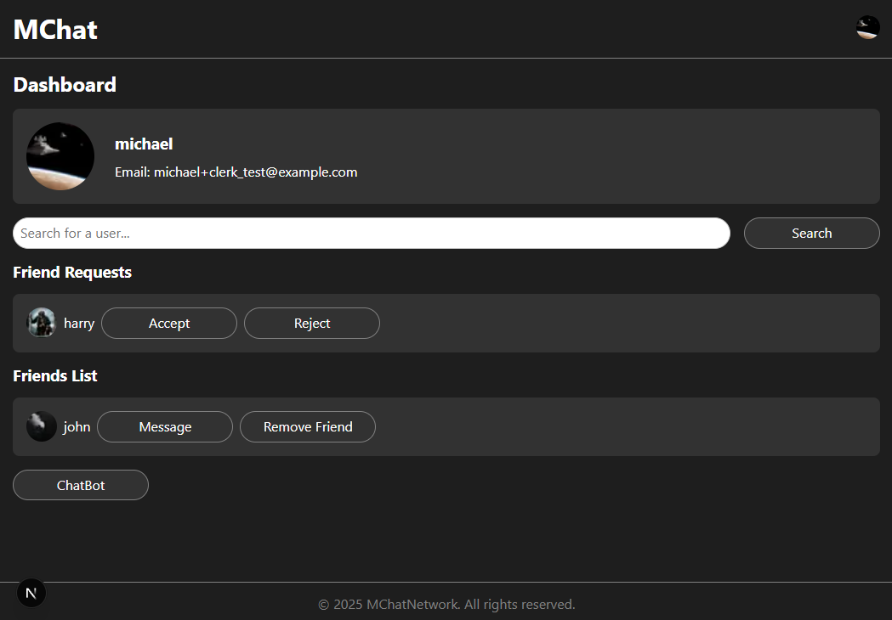

# MChat

The application is deployed on Vercel and can be viewed [here](https://mchat-beta.vercel.app/).

## About the project

A real-time, full-stack chat application built with **Next.js**, **Clerk for authentication**, and **Pusher for live messaging**.



### Features

- User authentication via Clerk.
- Real-time messaging with Pusher.
- Profile pictures for users.
- Friend requests.
- AI chatbot.

## Setup

### Dependencies

- [Clerk](https://clerk.com/) for user auth.
- [Pusher](https://pusher.com/) for real-time events.
- [OpenAI](https://openai.com/) for AI chatbot.

### Getting Started

This is a [Next.js](https://nextjs.org) project bootstrapped with [`create-next-app`](https://nextjs.org/docs/app/api-reference/cli/create-next-app).

First, run the development server:

```bash
npm run dev
# or
yarn dev
# or
pnpm dev
# or
bun dev
```

Open [http://localhost:3000](http://localhost:3000) with your browser to see the result.

You can start editing the page by modifying `app/page.js`. The page auto-updates as you edit the file.
